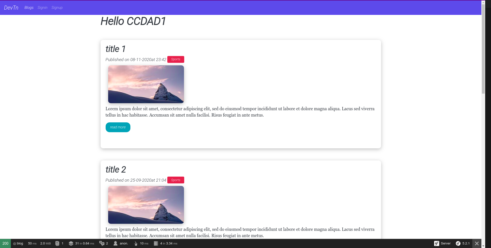
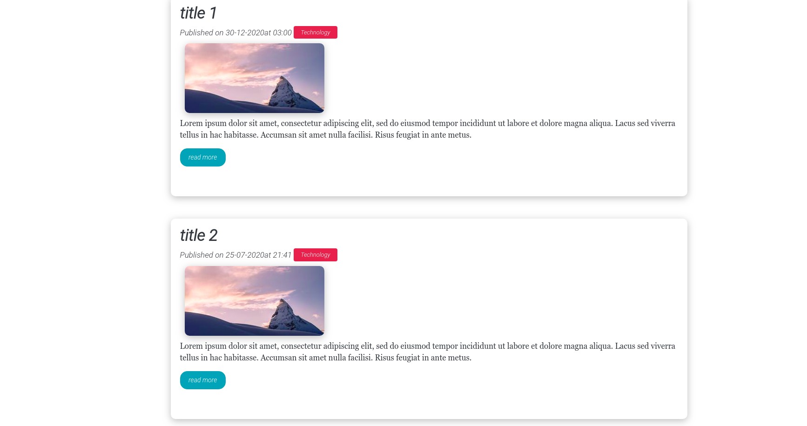
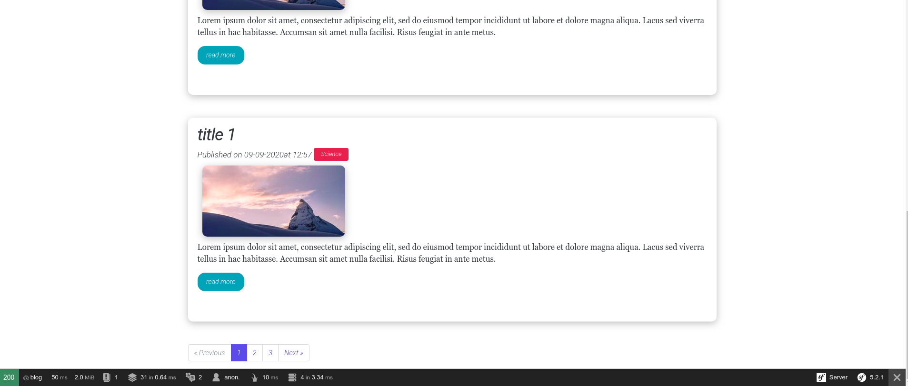
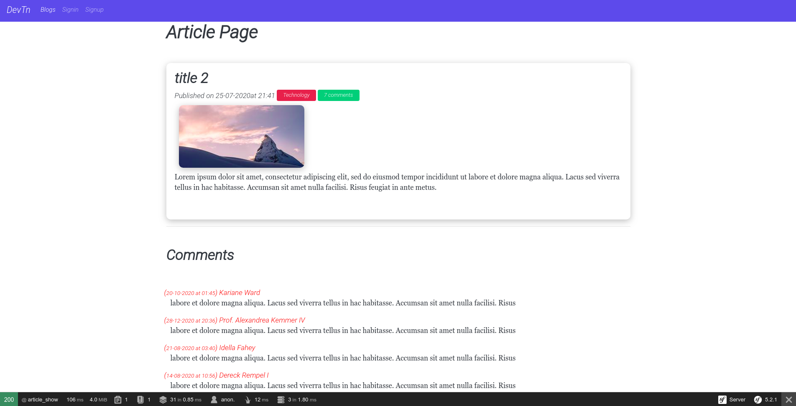
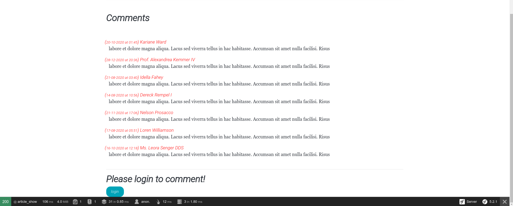
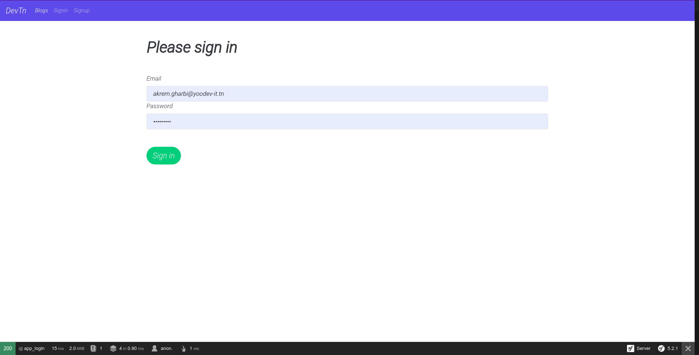
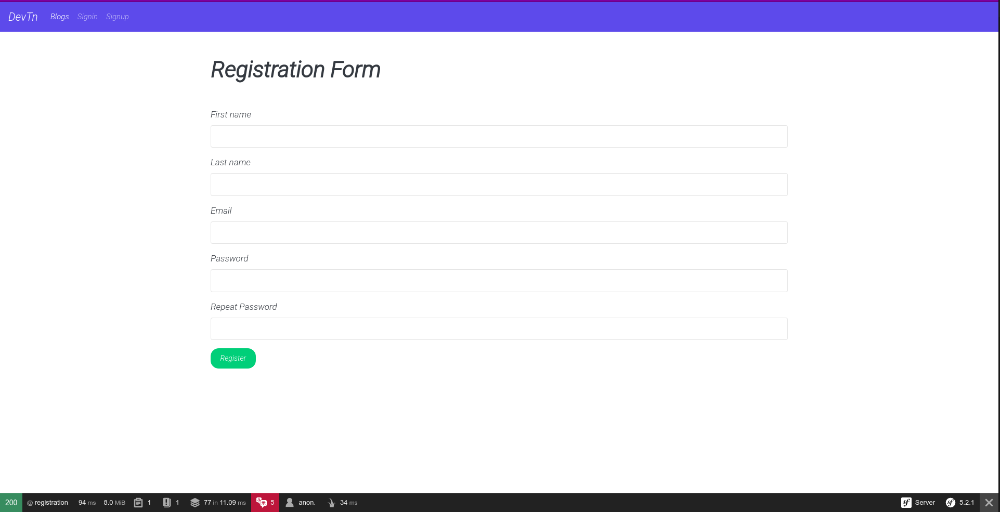
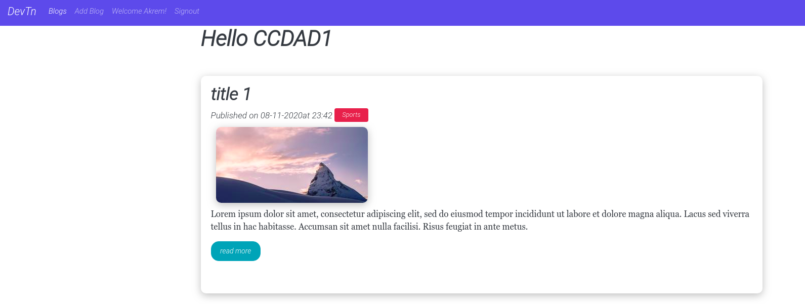

# projet-symfony5 - Blog System

# Installation

1) git clone https://github.com/akremdev/projet-symfony5.git
2) composer install
3) change .env credentials (username, password, dbname)
4) php bin/console doctrine:database:create
5) php bin/console doctrine:schema:update --force   ||    php bin/console make:migration ( les 2 sont valables)
6) php bin/console doctrine:fixture:load
7) symfony serve

# screenshots

